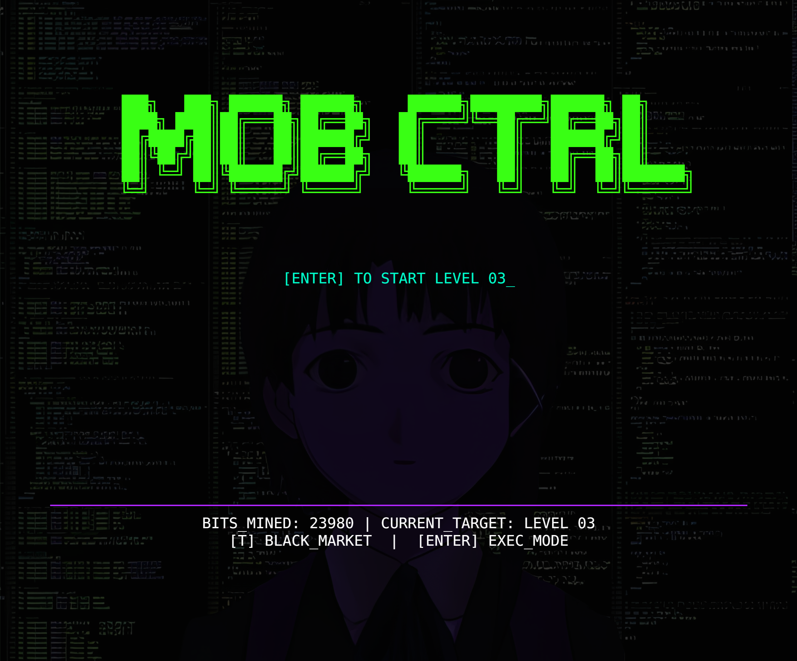
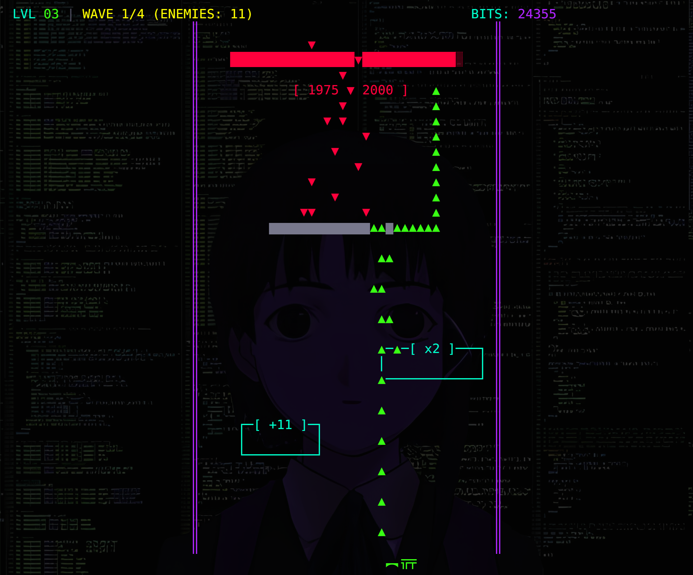
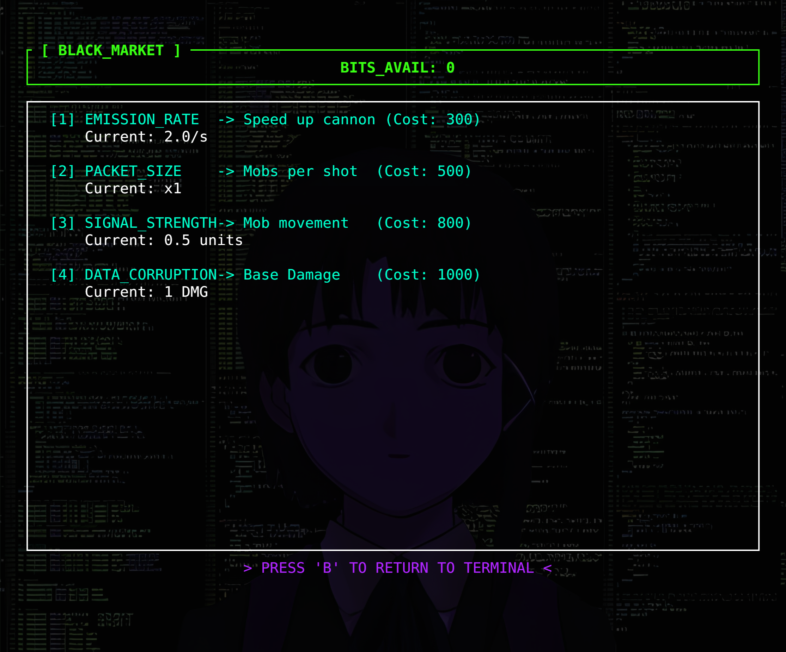

# Cyberpunk Mob Control

A terminal-based tactical management simulation built with Rust and the Ratatui framework. This application provides a high-performance terminal user interface (TUI) for managing units in a cyberpunk-themed environment.

> **Note**: This project was made for fun only.


## demo





## Prerequisites

To build and run this project, ensure the following tools are installed on your system:

1. **Rust Toolchain**: You must have the latest stable version of Rust and Cargo installed. You can install them via [rustup.rs](https://rustup.rs/).
2. **Git**: Required for cloning the repository.
3. **Terminal Emulator**: A modern terminal emulator with True Color support is recommended for the best visual experience.

## Installation

Follow these steps to set up the project locally:

1. **Clone the Repository**:
   ```bash
   git clone https://github.com/username/mob-control-cli.git
   ```

2. **Navigate to the Project Directory**:
   ```bash
   cd mob-control-cli
   ```

3. **Build the Project**:
   Build the optimized release binary using Cargo:
   ```bash
   cargo build --release
   ```

## Usage

Once the build process is complete, you can launch the application using the following command:

```bash
cargo run --release
```

Alternatively, you can execute the compiled binary directly from the build directory:

```bash
./target/release/cyberpunk-mob-control
```

## Controls

The interface is navigated entirely via the keyboard:

- **Arrow Keys / WASD**: Navigate through menus or control units.
- **Enter**: Confirm selection.
- **Esc / Q**: Exit the application or return to the previous screen.

## Project Structure

The codebase is organized into the following modules:

- `src/main.rs`: Application entry point and terminal initialization.
- `src/app.rs`: Core application logic and state management.
- `src/ui.rs`: UI rendering logic using Ratatui widgets.
- `src/models.rs`: Data structures and domain models.

## License

This project is licensed under the MIT License. See the LICENSE file for details.
